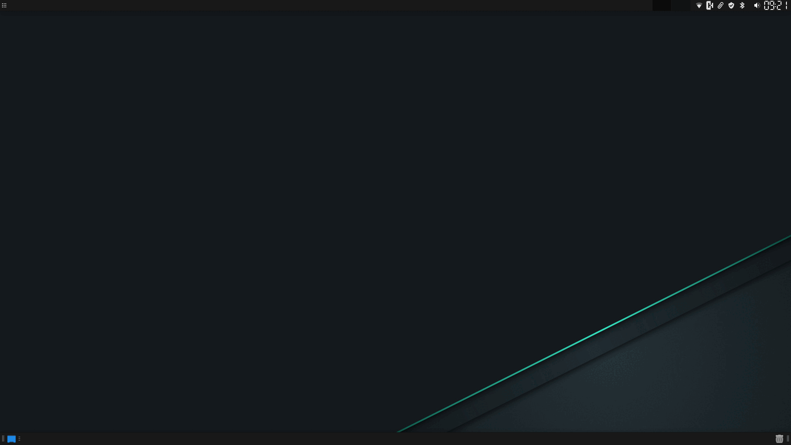

EnvyControl Tray

A lightweight GTK tray application for switching GPU modes using EnvyControl on Linux.
Provides quick access to Integrated, NVIDIA, and Hybrid modes directly from your system tray.

Designed for simplicity, stability, and seamless integration with EnvyControl.

## 📸 Screenshots



## Features

    🖥️ Switch between Integrated, NVIDIA, and Hybrid GPU modes

    🔄 Automatically prompts for reboot when required

    🧩 Clean GTK tray icon interface

    🚀 Starts automatically on login (autostart included)

    🔧 No root required to run the tray app itself

    🔒 Uses pkexec for secure privilege elevation when switching modes

## Requirements

The following packages must be installed:

    envycontrol

    python

    python-gobject

    gtk3

On Arch Linux these are installed automatically when using the AUR package.

## Installation

### Arch Linux (AUR)

Once uploaded to AUR:

```bash
yay -S envycontrol-tray

Manual installation
Clone the repository:
git clone https://github.com
cd envycontrol-tray

Run the script manually:

python3 envycontrol-tray.py

Autostart
The AUR package installs an autostart entry:
/etc/xdg/autostart/envycontrol-tray.desktop
This means the tray app will start automatically after login.
If you want to disable autostart, simply use your desktop environment’s Startup Applications settings.
No root permissions are required to disable or enable autostart.
Usage
After installation, you can start the tray app manually:

envycontrol-tray

Or simply reboot — it will start automatically.
Right‑click the tray icon to choose:

    Integrated
    NVIDIA
    Hybrid

If a mode change requires a reboot, you will be notified.
Icons
Icons are included in:
/usr/share/envycontrol-tray/

You can replace them with your own if desired.
License
MIT License
Feel free to modify and contribute.
Contributing
Pull requests and suggestions are welcome.
If you encounter issues, please open a GitHub issue.


